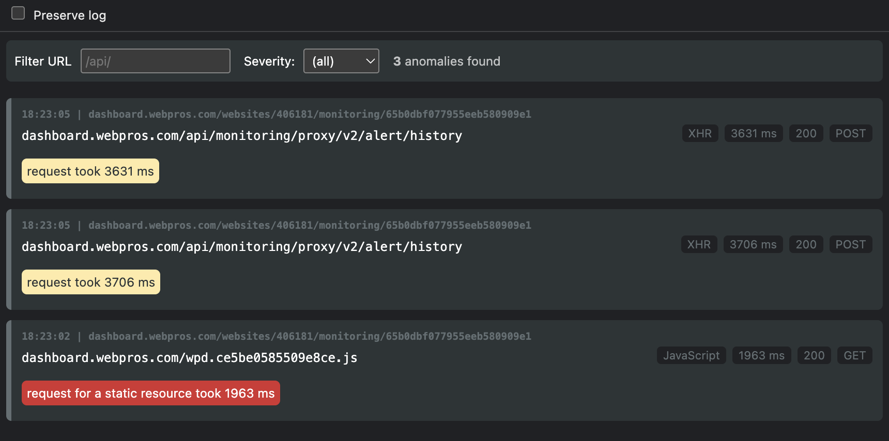

# Inspect - Chrome Extension

Development Audit is a Chrome DevTools extension that monitors network traffic during development and highlights
potential issues such as insecure HTTP requests, large responses, missing cache headers, or slow requests. It focuses
only on relevant findings, provides filtering by URL, method, and severity, and offers the option to preserve logs
across navigations.

With its clear, responsive interface and modular, easily extensible checks, it helps developers
quickly identify and address performance or security problems without having to dig through the standard network tab.

## Changelog & Ideas

- See [changelog](docs/changelog.md)
- See [ideas](docs/ideas.md)

## Rules

### General

- **Large Response (Content-Length > 1 MB)**  
  This rule checks if the size of an HTTP response exceeds 1 MB. Large responses can significantly increase loading
  times and negatively impact user experience. In many cases, resources such as images, scripts, or data should be
  compressed or split into smaller chunks. This helps conserve bandwidth and improves overall performance.

- **Slow Request (Duration > 800 ms)**  
  When a request takes longer than 800 milliseconds, it is flagged as slow. Such delays may be caused by network
  latency, overloaded servers, or inefficient backend operations. Consistently slow requests should be investigated to
  identify bottlenecks and ensure system reliability. The goal is to maintain a smooth and responsive user experience.

- **Status Code (>= 400)**  
  This rule triggers whenever the HTTP status code is 400 or higher. Codes in this range indicate client errors (e.g.,
  400 Bad Request, 404 Not Found) or server errors (e.g., 500 Internal Server Error). Frequent errors of this type may
  point to broken links, incorrect API usage, or server misconfigurations. Monitoring these codes helps improve the
  robustness of the application.

### HTTP

- **Insecure Request (HTTP)**  
  This rule flags any requests made over plain HTTP instead of HTTPS. Using HTTP exposes data to potential interception
  and tampering since traffic is not encrypted. Modern best practices require enforcing HTTPS to protect sensitive
  information and maintain trust. Identifying insecure requests helps ensure proper security across the application.

- **Missing Cache Header (static resources)**  
  This rule checks whether static resources (e.g., images, scripts, stylesheets) include appropriate cache headers.
  Without caching, browsers must re-download the same files on each visit, which increases bandwidth usage and slows
  down page loads. Proper caching strategies reduce server load and improve perceived performance for end users. Adding
  headers such as `Cache-Control` is key to efficient content delivery.

- **HTTP/1.1 (instead of HTTP/2)**  
  This rule warns when a connection falls back to HTTP/1.1 instead of using HTTP/2. HTTP/2 offers multiplexing, header
  compression, and better utilization of network resources. Staying on HTTP/1.1 can lead to slower resource loading and
  reduced scalability. Ensuring servers and clients support HTTP/2 helps maximize performance.

- **Apache header (system) with version**  
  This rule detects when the `Server` header reveals that Apache is used, along with its version number. Exposing
  detailed version information can increase the risk of targeted attacks against known vulnerabilities. While the server
  may still function correctly, hiding or minimizing such headers is a common hardening practice. Securing server
  configurations in this way helps reduce the attack surface.

## Installation (development version)

Download and unpack the latest version from GitHub
https://github.com/startwind/chrome-inspector/archive/refs/heads/main.zip

Switch on developer mode in Chrome ([chrome://extensions](chrome://extensions)) and load the extension from the unpacked
directory.

## Usage

Open Chrome DevTools, switch to the **Inspection** panel, and browse your application. Findings for requests from
the active tab will appear automatically. Use the filter controls at the top to narrow results by URL, HTTP method,
severity, or third-party requests. Enable *Preserve log* to keep findings when navigating between pages.

## Contributing

Contributions are welcome. New checks can be added by creating a class that implements the `check(req)` method and
returning either `false` or a finding object. Please open issues or pull requests on GitHub.